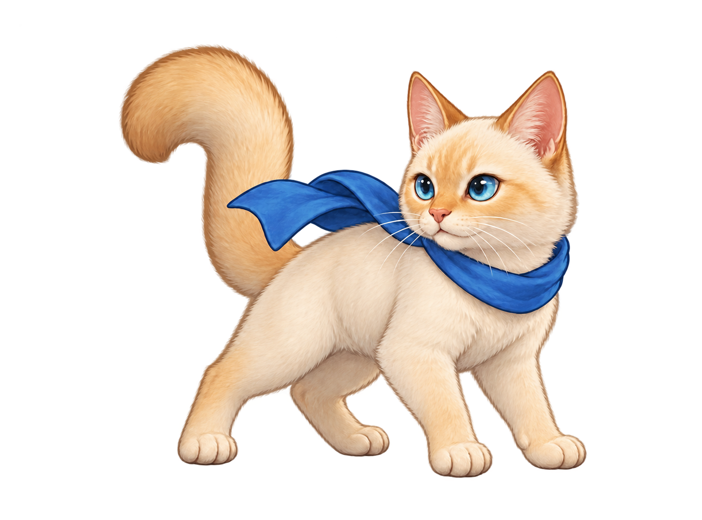
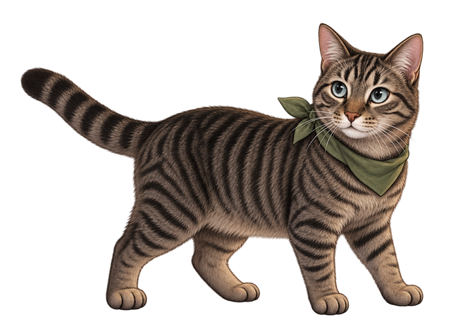
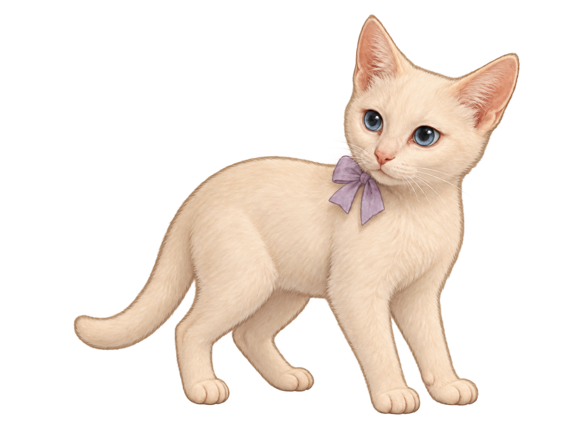
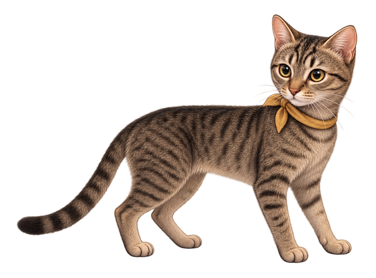

# Cats of the Changing Sky

**For Henry.** 🐈✨

Cats of the Changing Sky is a small, self-contained climbing game for desktop Chrome and Microsoft Edge. Choose a cat, a season, and a way to play. Steer from one floating target to the next as a painted village gives way to mountains, weather, and an open sky. Each contact sends your cat higher; a missed landing can send them all the way back down.

The game opens in its own browser tab when you click the extension icon. It has no account or online play. Scores, preferences, fish, gear, and supplies are saved in the browser on that device.

## Meet the climbers

| Cat | In the game |
| --- | --- |
|  **Zima** | A bright adventurer with a blue scarf. |
|  **Earl Grey** | A sturdy striped explorer. |
|  **Betty Davis** | A petite wanderer with a lavender bow. |
|  **Gracie Bell** | A graceful climber. |

The cats share the same play rules. Pick the one you want to see on the climb.

## Four changing worlds

The scenery moves with the ascent rather than repeating a short backdrop. Each season has its own ground, sky, floating targets, music, and airborne visitor.

| Season | What you'll find |
| --- | --- |
| **Winter** ❄️ | A moonlit snow village, ringing bells, aurora, and an aurora bird. |
| **Spring** 🌸 | Rain and blossoms, raindrop and flower targets, and a dragonfly. |
| **Summer** 🌻 | Sunflower fields, warm open sky, and a swallow. |
| **Autumn** 🍂 | Harvest fields, pumpkins, lanterns, and a crow. |

## Choose a way to climb

| Mode | How it works |
| --- | --- |
| **Classic** | An endless high-score climb. Keep reaching targets; a return to the ground ends the run. |
| **Zen** | A continuous climb with gentler restarts. Landing on the ground lets you launch again without clearing that run's score. |
| **Expedition** | A longer summit journey with goals at 14,000, 28,000, and 42,000 altitude. Two base camps let you retry the next stretch without restarting from the village. Only completed summit runs enter the Expedition score board. |

You choose the cat, season, and mode on the title screen. The scoreboard keeps records separately for each mode and shows the cat and season for recorded runs.

## How to play

1. Choose your cat, season, and mode, then select **Start climb**.
2. Press **Space**, **Enter**, or click to launch from the ground.
3. Steer with **A/D**, **←/→**, or move the mouse across the game. Line up with the next floating target to bounce higher.
4. Land on targets to earn points. Basic, silver, and crystal targets are worth **10, 20, and 30 points**, multiplied by your current bonus.
5. Catch a passing bird, dragonfly, swallow, or crow to raise that multiplier, up to **×20**. Keep the climb going and see how high you can reach.

| During play | Key |
| --- | --- |
| Move left or right | `A` / `D`, arrow keys, or mouse |
| Launch or continue | `Space`, `Enter`, or click |
| Pause or resume | `P` |
| Open or close Settings | `N` |
| Mute or unmute | `M` |
| Open the scoreboard | `L` |
| Return to the title screen | `Esc` |

The title screen also has separate Music and Effects sliders.

## Fish, gear, and supplies (beta)

Climbing into a new altitude band and catching the first three airborne visitors in a run earn painted fish. Expedition base camps and the summit give extra fish. Fish are separate from score. Open **Gear & supplies** on the title screen to spend them. Gear stays in your collection; supplies are consumed when used. Rare mystery crates appear along the climb. Their displayed reward cycles faster as time passes; touching a crate grants its current reward. Fish are more common than items, and a crate you leave behind pays two fish instead. The shop is the reliable way to get a specific item.

The numbered item bar along the lower edge shows each item's silhouette and count. Click an icon or press its number on the keyboard's number row. **1–6** equip or unequip the six gear items; only one item in each gear slot can be active. Owned gear appears in color, and active items glow. **7** arms or disarms a Cat Bed during a Classic run. If armed, one Bed is consumed to rescue a fatal fall near your last height with the multiplier reset to x1. **8** arms or disarms a Camp Provision at an Expedition camp; it is consumed on the next launch for a stronger opening jump. **9** immediately uses a Route Reroll at an Expedition camp. **0** shows your total fish; fish can be spent in **Gear & supplies** on the title screen. The bar also accepts mouse clicks and gives feedback when an item is empty or unavailable in the current mode. Zen's ground relaunch and Expedition's base camp retries remain free.

Scores from runs using functional gear or supplies are labeled **Equipped**. Earlier records and runs without them are **Standard**. Press `N` or the gear symbol in the lower right to open Settings; opening it during a run pauses play. Settings contains the full control guide, lets you choose any cat's painted bust for the browser toolbar icon, and exports the browser's saved game data as JSON. Zima is the default icon when installed. Your toolbar choice is independent of the cat you play and is restored when the browser starts. The browser's extension management page keeps the packaged default icon. The export is a backup; this beta does not yet import it.

## Install from GitHub

For the current stable release, get the game ZIP from the [latest release](https://github.com/psusedjem-blip/cats-of-the-changing-sky/releases/latest). Download the asset named `cats-of-the-changing-sky-v3.34.26.zip`; GitHub's automatic **Source code** ZIP is different. Extract the download and keep its `zima-skybells-extension` folder in a permanent location.

- **Chrome:** Open `chrome://extensions`, enable **Developer mode**, choose **Load unpacked**, and select the extracted `zima-skybells-extension` folder.
- **Edge:** Open `edge://extensions`, enable **Developer mode**, choose **Load unpacked**, and select the same folder.

The selected folder should contain `manifest.json`. Click or pin the extension's cat icon to open the game. This GitHub download is a manual install: future releases need to be downloaded and loaded again. Scores and settings are stored locally by the browser installation.

## About the art

The character and scenery art was **generated with AI**, then selected, revised, and integrated for this game. The dedication is simple: **For Henry.**

## Beta source and build

The `main` branch is the stable game. Work on this `beta` branch remains separate until it is ready for a stable release. The runtime is `index.html`, `background.js`, `style.css`, compiled `main.js`, and `assets/`. Edit the TypeScript files in `source/`; `main.ts` brings them together into the generated `main.js`. Music lives in `source/audio.ts`, climbing and contacts in `source/gameplay.ts`, scene painting in `source/scenery.ts` and `source/scene-render.ts`, characters and targets in their render files, and menus in `source/hud-render.ts` and `source/progression-ui.ts`. The runtime stylesheet is `style.css`.

Install Node.js and Python 3, then run `npm ci` and `npm run check`. `npm run build` compiles TypeScript. `npm run package:store` builds the store ZIP with `manifest.json` at its root; `npm run package:sideload` builds the GitHub ZIP with an enclosing extension folder. The packaging script checks archive integrity and asset references before replacing a release ZIP. Review each cat, season, and mode in a browser before distributing a beta package.

The climb uses upward world coordinates. Bells move downward through `fieldDrop`, while painted sky panels use fixed altitude anchors in `source/chapters.ts`. Mystery crates have fixed world positions. Keep the two coordinate systems distinct when changing contacts or scenery. Existing `zima-skybells-*` local storage keys hold scores and preferences; `cats-changing-sky-progression-v1` holds fish, owned gear, equipped slots, and supplies. Increase the manifest version and the `main.js` query version together for each packaged update.

## Privacy policy

Cats of the Changing Sky is an offline browser extension game. It does not ask for an account and does not send game data to the developer or third parties. It does not use analytics, advertising, or online services. The game stores your chosen cat, season, mode, audio settings, scores, fish, gear, and supplies in this browser's local storage so they remain available the next time you play. The toolbar icon choice is also kept in the browser's extension storage so it can be restored when the browser starts. You can export a copy of the saved game data in Settings. Removing the extension and its data clears the browser copy. For questions, use the [public issue tracker](https://github.com/psusedjem-blip/cats-of-the-changing-sky/issues).
