# Cats of the Changing Sky

**For Henry.** 🐈✨

Climb through twelve painted worlds as Zima, Earl Grey, Betty Davis, or Gracie Bell. Bounce from target to target, catch passing visitors, and see how high you can go. The game opens in a browser tab from its extension icon. It works offline and needs no account.

## Install the game

Choose the [latest stable release](https://github.com/psusedjem-blip/cats-of-the-changing-sky/releases/latest) or a [beta prerelease](https://github.com/psusedjem-blip/cats-of-the-changing-sky/releases) and expand its **Assets** list. Download a game file from that release; GitHub's automatic **Source code** ZIP is not the install file.

**Chrome or Edge:** Download `cats-of-the-changing-sky-v<version>.zip`, extract it, and keep the extracted `zima-skybells-extension` folder somewhere permanent.

1. Open `chrome://extensions` in Chrome or `edge://extensions` in Edge.
2. Turn on **Developer mode** and choose **Load unpacked**.
3. Select the extracted `zima-skybells-extension` folder. It should contain `manifest.json`.
4. Click or pin the extension's cat icon to open the game.

To update an unpacked install, replace the files **inside the same extracted folder**, then select **Reload** on the extensions page. Keeping that folder in place helps the browser retain its saved game data.

**Firefox 142 or newer:** If the release includes `cats-of-the-changing-sky-v<version>-firefox.xpi`, download that **Mozilla-signed** file. Open **Add-ons and themes** in Firefox, choose the gear menu → **Install Add-on From File**, select the XPI, and choose **Add**. The `-firefox-upload.zip` file is unsigned and is for Mozilla submission, not permanent installation.

Each browser keeps its own save. Use **Settings → Export game data** before switching browsers or replacing an install, then **Import game data** in the new one.

## Choose a climber

All four adult cats are ready to play. Their kitten forms use their own in-game animation and can be unlocked with fish earned by playing.

| Cat | Adult | Kitten | Kitten unlock |
| --- | :---: | :---: | ---: |
| **Zima** |  | 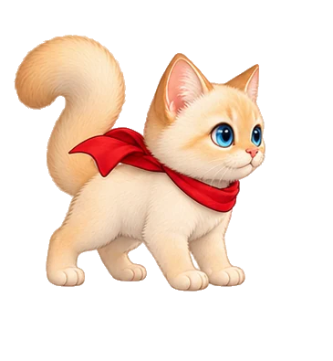 | 60 fish |
| **Earl Grey** |  | 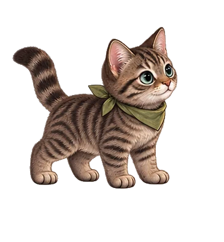 | 70 fish |
| **Betty Davis** |  | 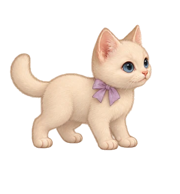 | 80 fish |
| **Gracie Bell** |  | 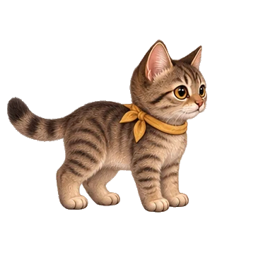 | 90 fish |

## Explore twelve worlds

Every world follows the same climb: a distinct starting place gives way to painted middle heights and an illustrated upper sky. Each has its own targets, airborne visitor, ambient effects, and music. Winter, Spring, Summer, and Autumn are free; the others unlock permanently with fish. The gallery follows the title-screen carousel order.

|  |  |  |  |
| :---: | :---: | :---: | :---: |
| 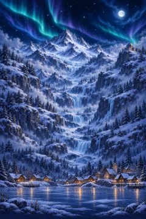 **Winter** · Free Snow village to aurora | 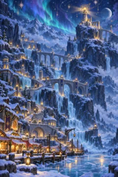 **Starlight Eve** · 30 fish Harbor to astral lights | 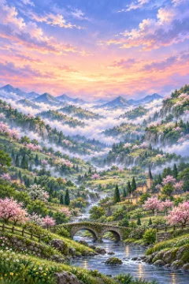 **Spring** · Free Blossoms to cloud garden | 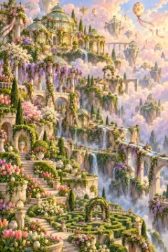 **Great Egg Hunt** · 45 fish Gardens to conservatory |
| 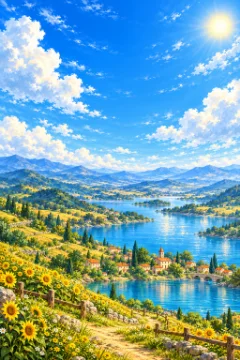 **Summer** · Free Sunflowers to open sky | 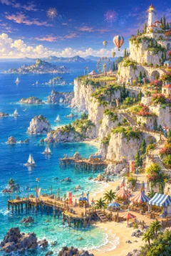 **Fireworks Fair** · 60 fish Pier to firework sky | 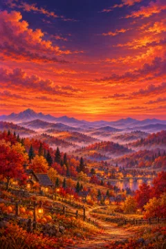 **Autumn** · Free Harvest fields to lantern dusk | 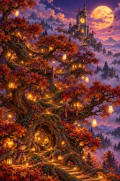 **Moonlit Masquerade** · 75 fish Treehouses to moonlight |
|  **The Great Yarn Tangle** · 90 fish Yarn nest to starry loom | 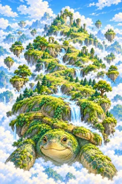 **Turtleback World** · 105 fish Turtle to shell gardens | 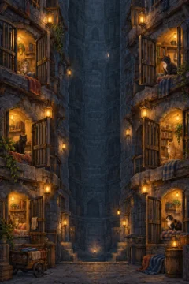 **Cat Lockup Expedition** · 120 fish Cells to freedom gate | 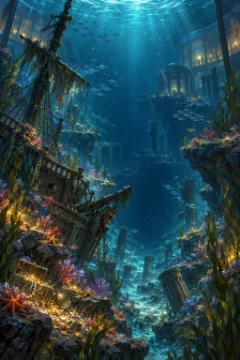 **Moonlit Aquarium** · 135 fish Ruins to moonlit rim |

All twelve worlds support each play mode:

| Mode | What happens |
| --- | --- |
| **Classic** | Climb for a high score. The run ends when you fall back to the ground. |
| **Zen** | Land and launch again without losing that run's score. |
| **Expedition** | Reach the summit through three stages, with two base camps where you can retry. |

## Play and progress

Choose a cat, world, and mode, then select **Start climb**. Press **Space**, **Enter**, or click to launch. Steer with **A/D**, the arrow keys, or the mouse. Land on a target to bounce higher. Bronze, silver, and crystal targets start at 10, 20, and 30 points; each hit uses the multiplier active at that moment. Catching an airborne visitor scores points, raises the multiplier for later hits, and gives you another lift. Your results show base points and multiplier bonus separately.

| Action | Control |
| --- | --- |
| Move | `A` / `D`, left/right arrows, or mouse |
| Launch or continue | `Space`, `Enter`, or click |
| Pause or resume | `P` |
| Open Settings | `N` or the upper-right Settings shortcut |
| Open scoreboard | `L` |
| Mute or unmute | `M` |
| Return to title | `Esc` |

Climbing and catching visitors earn fish, which you can spend on worlds, kitten forms, gear, and supplies. Mystery crates can grant a reward when touched. The item bar at the bottom shows what you own; select an item by clicking it or pressing its number. **Gear & supplies** on the title screen explains each item's effect.

The title screen also has **Achievements**: 25 illustrated tracks, each with Bronze, Silver, and Gold milestones. Unlocks appear briefly during play and remain in your collection. Scores, fish, unlocks, achievements, and settings are saved in this browser. **Settings** can export or import that data as a JSON file.

## About the art and privacy

The character and scenery art was generated with AI, then selected, revised, and integrated for this game. **For Henry.**

The extension works offline. It has no account, advertising, analytics, or online game service, and it does not send game data to the developer or third parties. It stores your choices and progress in your browser; removing the extension and its data removes that browser's copy. For questions, use the [public issue tracker](https://github.com/psusedjem-blip/cats-of-the-changing-sky/issues).

For version history, see the [changelog](CHANGELOG.md). For source layout, test controls, and packaging, see the [development guide](docs/DEVELOPMENT.md).
